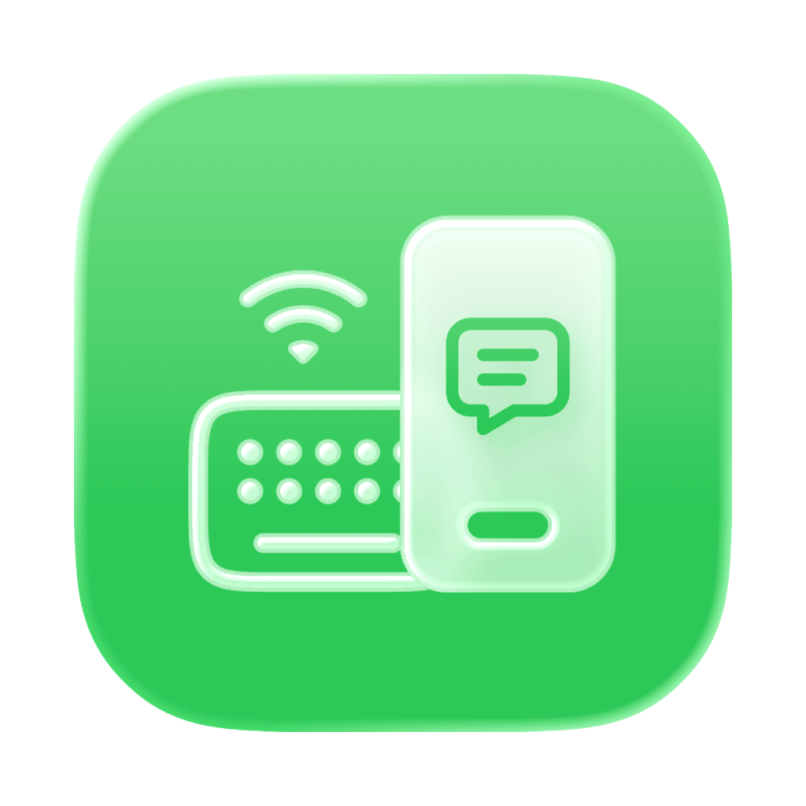
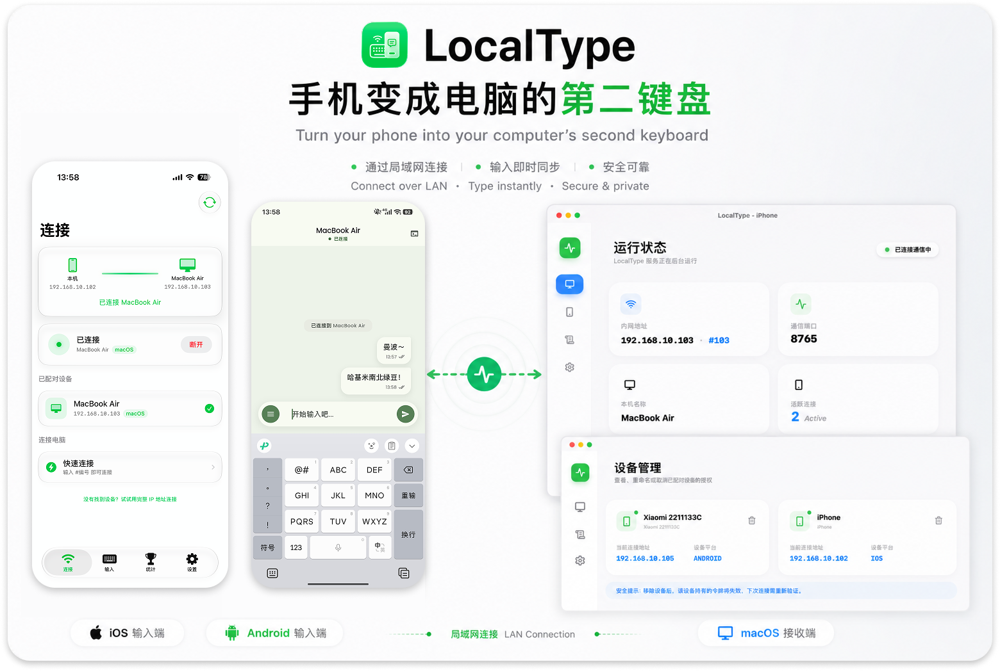

# LocalType iOS

<p align="center">
  
  <br />
  
  
  
</p>

**LocalType** iOS 客户端 — 将 iPhone 变为电脑的「第二键盘」。通过局域网连接，在手机上输入长文本，一键发送到电脑。

> [!IMPORTANT]
> **主仓库：[VenenoSix24/localtype](https://github.com/VenenoSix24/localtype)**

<p>
  
</p>


## 功能

- **无线输入** — 手机打字，电脑接收
- **触觉反馈** — 操作振动反馈，可关闭
- **快捷短语** — 自定义常用文本，一键发送
- **快速连接** — 输入桌面端显示的 #编号 即可连接
- **外观自定义** — 浅色模式、深色模式、多主题色、气泡样式
- **聊天式体验** — 消息列表、发送状态、已发文本可复制/再次编辑/再次发送


## 快速上手

### 1.下载安装

您可以直接前往 [GitHub Releases](https://github.com/VenenoSix24/localtype-ios/releases) 页面下载预编译好的安装包。

### 2.从源代码编译

要求：`Xcode 26+`、`iOS 26.0+ SDK`

```bash
git clone https://github.com/VenenoSix24/localtype-ios.git
cd localtype-ios
open LocalType_iOS.xcodeproj
```

选择目标设备，⌘R 运行即可。


## 技术栈

| 层        | 技术                                    |
| -------- | --------------------------------------- |
| 框架      | SwiftUI + @Observable                   |
| 通信      | WebSocket (Starscream-style) + TCP probe |
| 本地存储  | UserDefaults + Codable                  |
| 设计语言  | iOS 26 Liquid Glass（.glassEffect）     |


## 许可协议

本项目基于 **[AGPL-3.0](LICENSE)** 许可协议开源。
